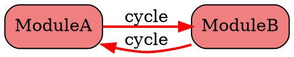
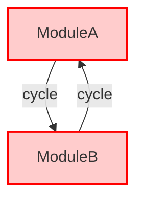

# Laravel 循環依存関係検出ツール

モジュラーモノリスアーキテクチャにおける循環依存関係を検出・可視化するための強力なLaravelパッケージです。

## 機能

- 🔍 **循環依存関係の検出**: 深さ優先探索アルゴリズムを使用してモジュール間の循環依存関係を自動検出
- 📊 **複数の出力形式**: コンソール、JSON、DOT（Graphviz）、Mermaidダイアグラム形式に対応
- 📈 **依存関係の可視化**: インタラクティブな依存関係グラフの生成
- ⚡ **パフォーマンス最適化**: 100以上のモジュールを持つ大規模コードベースを効率的に分析
- 🎯 **Laravel統合**: Laravelのサービスコンテナとコンソールコマンドとのシームレスな統合

## インストール

Composerを使用してパッケージをインストール：

```bash
composer require laravel-circular-dependency-detector/laravel-circular-dependency-detector --dev
```

### 設定ファイルの公開

インストール後、プロジェクトに合わせてカスタマイズするために設定ファイルを公開：

```bash
php artisan vendor:publish --provider="LaravelCircularDependencyDetector\ServiceProvider" --tag="config"
```

これにより、`config/circular-dependency-detector.php`がLaravelアプリケーションに作成され、すべての設定をカスタマイズできます。

### 代替方法：設定ファイルを公開しない場合

設定を公開したくない場合は、環境変数または`config/app.php`で直接設定することも可能です：

```php
// AppServiceProviderまたはカスタムServiceProviderで
public function register()
{
    $this->app->configure('circular-dependency-detector', function() {
        return [
            'modules_path' => base_path('src'), // カスタムパス
            'scan_patterns' => [
                'domain' => 'Domain',
                'application' => 'Application',
            ],
            // ... その他の設定
        ];
    });
}
```

## 設定

`config/circular-dependency-detector.php`を編集してカスタマイズ：

```php
return [
    'modules_path' => app_path('Modules'),
    
    'scan_patterns' => [
        'controllers' => 'Controllers',
        'services' => 'Services',
        'repositories' => 'Repositories',
        'providers' => 'Providers',
        'models' => 'Models',
        'jobs' => 'Jobs',
        'listeners' => 'Listeners',
        // DDDパターン用
        'domain' => 'Domain',
        'application' => 'Application',
        'infrastructure' => 'Infrastructure',
    ],
    
    'ignore_patterns' => [
        '*/Tests/*',
        '*/Migrations/*',
        '*/Database/*',
    ],
    
    'allowed_dependencies' => [
        'Contracts',
        'Events', 
        'Exceptions',
        'DTOs',
        'Enums',
    ],
];
```

## 使用方法

### 循環依存関係の検出

```bash
php artisan modules:detect-circular
```

オプション：
- `--path=`: モジュールパスを上書き（例：app/Domain、src/Services）
- `--format={console|json|dot|mermaid}`: 出力形式（デフォルト：console）
- `--output=path`: ファイルに出力を保存

使用例：

```bash
# カスタムディレクトリ構造を分析
php artisan modules:detect-circular --path=app/Domain

# DDD構造用のJSONレポートを生成
php artisan modules:detect-circular --path=src --format=json --output=report.json

# Graphviz DOTファイルを生成
php artisan modules:detect-circular --format=dot --output=dependencies.dot

# 設定を変更せずに異なるプロジェクト構造を分析
php artisan modules:detect-circular --path=packages
php artisan modules:detect-circular --path=src/Bounded
```

### 依存関係グラフの生成

```bash
php artisan modules:graph
```

オプション：
- `--format={dot|mermaid}`: グラフ形式（デフォルト：dot）
- `--output=path`: グラフをファイルに保存

使用例：

```bash
# DOTグラフを生成してPNGに変換
php artisan modules:graph --format=dot --output=graph.dot
dot -Tpng graph.dot -o graph.png

# Mermaidダイアグラムを生成
php artisan modules:graph --format=mermaid --output=graph.md
```

## 出力例

### コンソール出力

```
=====================================
  循環依存関係分析レポート
=====================================

サマリー：
--------
  分析されたモジュール: 5
  発見された循環依存関係: 1
  ステータス: ❌ 問題が見つかりました

循環依存関係：
---------------------

1. 🔴 クリティカル (長さ: 2)
   サイクル: ModuleA → ModuleB → ModuleA
   影響を受ける依存関係:
   - ModuleA が App\Modules\ModuleB\Services\ServiceB を使用
   - ModuleB が App\Modules\ModuleA\Services\ServiceA を使用
```

### JSON出力

```json
{
  "analysis_timestamp": "2025-01-01T00:00:00Z",
  "summary": {
    "modules_count": 5,
    "cycles_count": 1,
    "has_issues": true
  },
  "cycles": [
    {
      "cycle": ["ModuleA", "ModuleB", "ModuleA"],
      "length": 2,
      "severity": "critical"
    }
  ],
  "dependencies": {}
}
```

### DOTグラフ出力



### Mermaidダイアグラム出力



## CI/CD統合

### GitHub Actions

```yaml
name: 依存関係チェック
on: [push, pull_request]
jobs:
  dependency-check:
    runs-on: ubuntu-latest
    steps:
      - uses: actions/checkout@v3
      - name: PHPのセットアップ
        uses: shivammathur/setup-php@v2
        with:
          php-version: '8.1'
      - name: 依存関係のインストール
        run: composer install
      - name: 循環依存関係のチェック
        run: php artisan modules:detect-circular --format=json --output=dependencies.json
```

### GitLab CI

```yaml
dependency-check:
  image: php:8.1
  script:
    - composer install
    - php artisan modules:detect-circular --format=json --output=dependencies.json
  artifacts:
    reports:
      junit: dependencies.json
    paths:
      - dependencies.json
```

## パフォーマンス

このパッケージはパフォーマンスに最適化されています：

- **100モジュール**: 30秒以内に分析完了
- **メモリ使用量**: 大規模プロジェクトでも512MB未満
- **ファイル制限**: 最大10,000個のPHPファイルをサポート

## 要件

- PHP ^8.1
- Laravel 9.x、10.x、または11.x
- nikic/php-parser ^4.15

## テスト

テストスイートの実行：

```bash
composer test
```

特定のテストスイートの実行：

```bash
# ユニットテストのみ
./vendor/bin/phpunit --testsuite=Unit

# 機能テストのみ
./vendor/bin/phpunit --testsuite=Feature
```

## トラブルシューティング

### モジュールが見つからない

設定の`modules_path`が正しいディレクトリを指していることを確認：

```php
'modules_path' => app_path('Modules'), // このパスを調整
```

### 依存関係が検出されない

動的クラス解決を使用する一部の依存関係は検出されない可能性があります。明示的なuse文の追加を検討してください。

### パフォーマンスの問題

大規模なコードベースの場合、以下で最適化できます：
- 不要なディレクトリをスキップするように`ignore_patterns`を調整
- 必要なディレクトリのみに`scan_patterns`を制限

## さまざまなアーキテクチャへの対応

### 従来のMVC構造

```php
'modules_path' => app_path('Modules'),
'scan_patterns' => [
    'controllers' => 'Controllers',
    'services' => 'Services',
    'repositories' => 'Repositories',
    'models' => 'Models',
],
```

### ドメイン駆動設計（DDD）

```php
'modules_path' => app_path('Domain'),
'scan_patterns' => [
    'domain' => 'Domain',
    'application' => 'Application',
    'infrastructure' => 'Infrastructure',
    'presentation' => 'Presentation',
],
```

### ヘキサゴナルアーキテクチャ

```php
'modules_path' => base_path('src'),
'scan_patterns' => [
    'core' => 'Core',
    'ports' => 'Ports',
    'adapters' => 'Adapters',
],
```

### マイクロサービスモノレポ

```php
'modules_path' => [
    base_path('services/user'),
    base_path('services/product'),
    base_path('services/order'),
],
```

## 高度な設定

### 複数のパス

複数のモジュールロケーションを分析：

```php
'modules_path' => [
    app_path('Modules'),
    app_path('Services'),
    base_path('packages'),
],
```

## 貢献

貢献は歓迎します！プルリクエストをお気軽に送信してください。

## ライセンス

MIT

## サポート

問題が発生した場合や機能リクエストがある場合は、[GitHubのイシュー](https://github.com/laravel-circular-dependency-detector/laravel-circular-dependency-detector/issues)を作成してください。

## クレジット

このパッケージは、クリーンなアーキテクチャを維持し、モジュラーモノリスアプリケーションにおける循環依存関係を防ぐために開発されました。