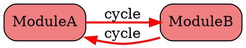
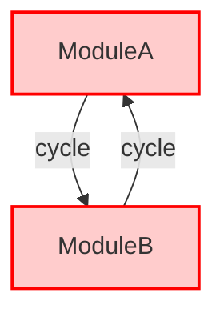

# Laravel Circular Dependency Detector

A powerful Laravel package for detecting and visualizing circular dependencies in modular monolith architectures.

## Features

- 🔍 **Circular Dependency Detection**: Automatically detect circular dependencies between modules using depth-first search algorithm
- 📊 **Multiple Output Formats**: Console, JSON, DOT (Graphviz), and Mermaid diagram formats
- 📈 **Dependency Visualization**: Generate interactive dependency graphs
- ⚡ **Performance Optimized**: Efficiently analyze large codebases with 100+ modules
- 🎯 **Laravel Integration**: Seamless integration with Laravel's service container and console commands

## Installation

Install the package via Composer:

```bash
composer require laravel-circular-dependency-detector/laravel-circular-dependency-detector --dev
```

### Publishing Configuration

After installation, publish the configuration file to customize it for your project:

```bash
php artisan vendor:publish --provider="LaravelCircularDependencyDetector\ServiceProvider" --tag="config"
```

This will create `config/circular-dependency-detector.php` in your Laravel application where you can customize all settings.

### Alternative: Without Publishing Config

If you don't want to publish the config, you can also configure it via environment variables or directly in your `config/app.php`:

```php
// In your AppServiceProvider or a custom ServiceProvider
public function register()
{
    $this->app->configure('circular-dependency-detector', function() {
        return [
            'modules_path' => base_path('src'), // Your custom path
            'detection_strategy' => 'namespace',
            'namespace_pattern' => 'App\\Domain\\*',
            // ... other settings
        ];
    });
}
```

## Configuration

Edit `config/circular-dependency-detector.php` to customize:

```php
return [
    'modules_path' => app_path('Modules'),
    
    // Namespace patterns configuration (NEW)
    // {MODULE} placeholder will be replaced with module name
    'namespace_patterns' => [
        'App\\Modules\\{MODULE}',     // app/Modules/ModuleName
        // 'Packages\\{MODULE}',       // packages/ModuleName
        // 'Domain\\{MODULE}',         // Custom domain structure
    ],
    
    'scan_patterns' => [
        'controllers' => 'Controllers',
        'services' => 'Services',
        'repositories' => 'Repositories',
        'providers' => 'Providers',
        'models' => 'Models',
        'jobs' => 'Jobs',
        'listeners' => 'Listeners',
        // For DDD patterns
        'domain' => 'Domain',
        'application' => 'Application',
        'infrastructure' => 'Infrastructure',
    ],
    
    'ignore_patterns' => [
        '*/Tests/*',
        '*/Migrations/*',
        '*/Database/*',
    ],
    
    'allowed_dependencies' => [
        'Contracts',
        'Events', 
        'Exceptions',
        'DTOs',
        'Enums',
    ],
];
```

### Example for packages/ directory structure (DDD/Ports and Adapters)

```php
return [
    'modules_path' => base_path('packages'),
    
    'namespace_patterns' => [
        'Packages\\{MODULE}',
    ],
    
    'scan_patterns' => [
        'application' => 'Application',
        'domain' => 'Domain',
        'infrastructure' => 'Infrastructure',
    ],
];
```

## Usage

### Detect Circular Dependencies

```bash
php artisan modules:detect-circular
```

Options:
- `--path=`: Override modules path (e.g., app/Domain, src/Services)
- `--format={console|json|dot|mermaid}`: Output format (default: console)
- `--output=path`: Save output to file

Examples:

```bash
# Analyze a custom directory structure
php artisan modules:detect-circular --path=app/Domain

# Generate JSON report for DDD structure
php artisan modules:detect-circular --path=src --format=json --output=report.json

# Generate Graphviz DOT file
php artisan modules:detect-circular --format=dot --output=dependencies.dot

# Analyze different project structures without modifying config
php artisan modules:detect-circular --path=packages
php artisan modules:detect-circular --path=src/Bounded
```

### Generate Dependency Graph

```bash
php artisan modules:graph
```

Options:
- `--format={dot|mermaid}`: Graph format (default: dot)
- `--output=path`: Save graph to file

Examples:

```bash
# Generate DOT graph and convert to PNG
php artisan modules:graph --format=dot --output=graph.dot
dot -Tpng graph.dot -o graph.png

# Generate Mermaid diagram
php artisan modules:graph --format=mermaid --output=graph.md
```

## Output Examples

### Console Output

```
=====================================
  Circular Dependency Analysis Report
=====================================

Summary:
--------
  Modules analyzed: 5
  Circular dependencies found: 1
  Status: ❌ Issues Found

Circular Dependencies:
---------------------

1. 🔴 CRITICAL (Length: 2)
   Cycle: ModuleA → ModuleB → ModuleA
   Affected dependencies:
   - ModuleA uses App\Modules\ModuleB\Services\ServiceB
   - ModuleB uses App\Modules\ModuleA\Services\ServiceA
```

### JSON Output

```json
{
  "analysis_timestamp": "2025-01-01T00:00:00Z",
  "summary": {
    "modules_count": 5,
    "cycles_count": 1,
    "has_issues": true
  },
  "cycles": [
    {
      "cycle": ["ModuleA", "ModuleB", "ModuleA"],
      "length": 2,
      "severity": "critical"
    }
  ],
  "dependencies": {}
}
```

### DOT Graph Output



### Mermaid Diagram Output



## CI/CD Integration

### GitHub Actions

```yaml
name: Dependency Check
on: [push, pull_request]
jobs:
  dependency-check:
    runs-on: ubuntu-latest
    steps:
      - uses: actions/checkout@v3
      - name: Setup PHP
        uses: shivammathur/setup-php@v2
        with:
          php-version: '8.1'
      - name: Install dependencies
        run: composer install
      - name: Check circular dependencies
        run: php artisan modules:detect-circular --format=json --output=dependencies.json
```

### GitLab CI

```yaml
dependency-check:
  image: php:8.1
  script:
    - composer install
    - php artisan modules:detect-circular --format=json --output=dependencies.json
  artifacts:
    reports:
      junit: dependencies.json
    paths:
      - dependencies.json
```

## Performance

The package is optimized for performance:

- **100 modules**: Analysis completes in under 30 seconds
- **Memory usage**: Less than 512MB for large projects
- **File limit**: Supports up to 10,000 PHP files

## Requirements

- PHP ^8.1
- Laravel 9.x, 10.x, or 11.x
- nikic/php-parser ^4.15

## Testing

Run the test suite:

```bash
composer test
```

Run specific test suites:

```bash
# Unit tests only
./vendor/bin/phpunit --testsuite=Unit

# Feature tests only
./vendor/bin/phpunit --testsuite=Feature
```

## Troubleshooting

### No modules found

Check that your `modules_path` in the configuration points to the correct directory:

```php
'modules_path' => app_path('Modules'), // Adjust this path
```

### Missing dependencies

Some dependencies might not be detected if they use dynamic class resolution. Consider adding explicit use statements.

### Performance issues

For large codebases, you can optimize by:
- Adjusting `ignore_patterns` to skip unnecessary directories
- Limiting `scan_patterns` to essential directories only

## Contributing

Contributions are welcome! Please feel free to submit a Pull Request.

## License

MIT